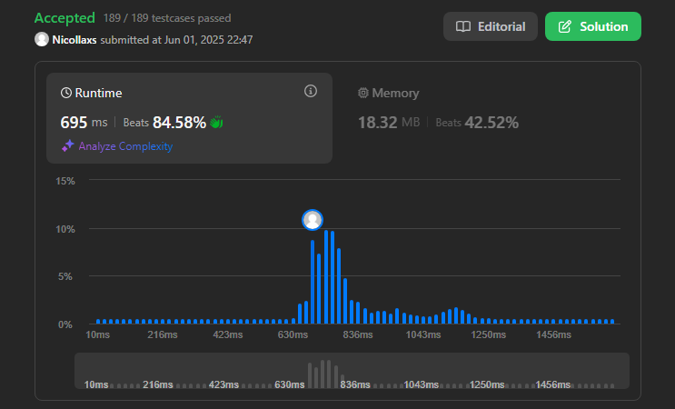
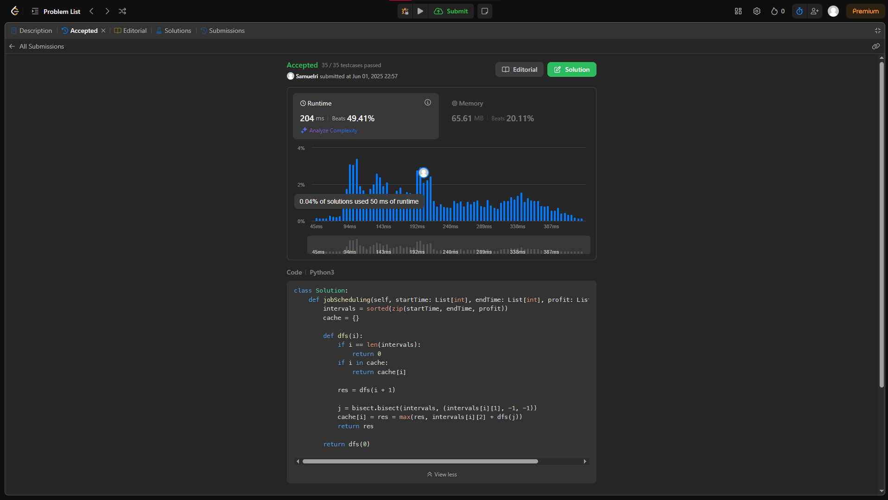
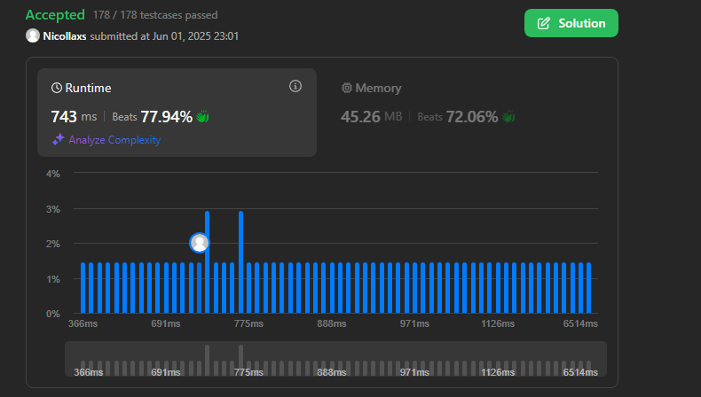

# Grafos1_Nic_Sam

**Conteúdo da Disciplina:** Grafos 1

---

## 👨‍🎓 Alunos

| Matrícula   | Aluno                                               |
|-------------|-----------------------------------------------------|
| 211062802   | Nicollas Gabriel Oliveira Sousa                   |
| 211031486   | Samuel Ribeiro da Costa                |

---

## 📌 Sobre

## 🧠 Questões Desenvolvidas

A dupla desenvolveu quatro questões, considerando o nível de dificuldade: duas de complexidade média e duas de maior dificuldade.

1. [322.Coin Changing](https://leetcode.com/problems/coin-change/description/) - Nível Médio
2. [797. All Paths From Source to Target](https://leetcode.com/problems/all-paths-from-source-to-target/?envType=problem-list-v2&envId=graph) - Nível Médio
3. [2025. Maximum Number of Ways to Partition an Array](https://leetcode.com/problems/maximum-number-of-ways-to-partition-an-array/description/) - Nível Difícil
4. [1235. Maximum Profit in Job Scheduling](https://leetcode.com/problems/maximum-profit-in-job-scheduling/submissions/1651204865/) - Nível Difícil


---

## 📸 Screenshots

### ✅ Accepted Coin Changing



<br>

### ✅ Accepted Maior Ciclo



### ✅ Accepted Maximum Number of Ways to Partition an Array



## ✅ Accepted Minimum Cost to Make at Least One Valid Path in a Grid 


---


## 🎥 Vídeo de Apresentação

Neste vídeo, apresentamos um resumo completo do trabalho desenvolvido, abordando os principais pontos discutidos ao longo do projeto.

[Assista no YouTube]()

---
## ⚙️ Instalação

**Linguagem:** Python 3.*


### Pré-requisitos

Python 3 instalado no sistema. 

### Como rodar

Clone o Repositório
```bash
git clone https://github.com/projeto-de-algoritmos-2025/Grafos1_Nic_Sam.git
```
<br>

Navegue até a pasta principal
```bash
cd seuRepositorio/Grafos1_Nic_Sam
```
<br>

Escolha qual código você deseja testar e rode
```bash
python3 nome_do_arquivo.py
```


